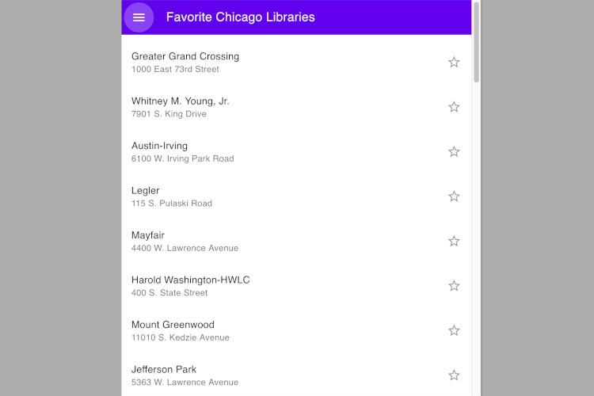

# chicago-libraries
Chicago Libraries

This application show the list of all Chicago Public Libraries. User can select any of those, and they will be saved to IndexedDB. Also, user can find location of his/her favorites libraries and show his/her location on the Google Map.

